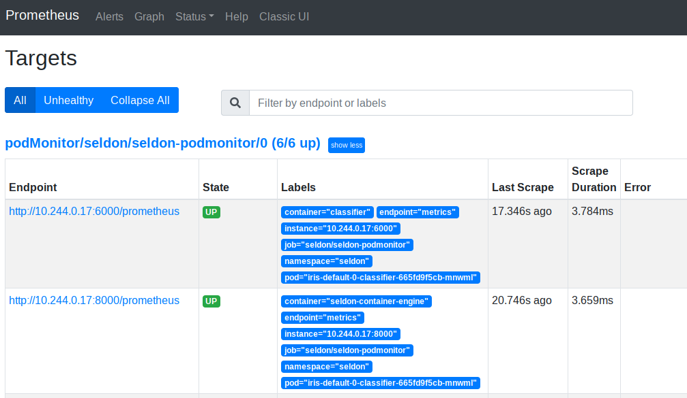

# 指标

Seldon Core 暴露了可被 Prometheus 抓取的指标。核心指标通过服务编排（`executor`）公开。

指标包括：

## 预估请求

- 从 ingress、API 网关或者 Ambassador 进入服务编排的流量

 * `seldon_api_executor_server_requests_seconds_(bucket,count,sum)` - `histogram` 指标类型
 * `seldon_api_executor_server_requests_seconds_summary_(count,sum)` - `summary` 指标类型

- 从组件中进入服务编排的流量，如：模型

 * `seldon_api_executor_client_requests_seconds_(bucket,count,sum)` - `histogram` 指标类型
 * `seldon_api_executor_client_requests_seconds_summary_(count,sum)` - `summary` 指标类型


每个指标都包含以下键名，这些对将从正在运行的 SeldonDeployment 部署自定义资源中获取：

  * service
  * deployment_name
  * predictor_name
  * predictor_version（来自预测元数据标签）
  * model_name
  * model_image
  * model_version


## Prometheus 控制器指标

### 安装

我们推荐使用 [Prometheus Operator](https://github.com/prometheus-operator/prometheus-operator) 配置 Prometheus。
[kube-prometheus](https://github.com/prometheus-operator/kube-prometheus) 栈配置可以很容易的通过 [Bitnami Helm Charts](https://github.com/bitnami/charts/tree/master/bitnami/kube-prometheus/) 安装。

```bash
kubectl create namespace seldon-monitoring

helm upgrade --install seldon-monitoring kube-prometheus \
    --version 6.9.5 \
	--set fullnameOverride=seldon-monitoring \
    --namespace seldon-monitoring \
    --repo https://charts.bitnami.com/bitnami

kubectl rollout status -n seldon-monitoring statefulsets/prometheus-seldon-monitoring-prometheus
```

以下 pods 应当出现在 `seldon-monitoring` 空间：

```bash
$ kubectl get pods -n seldon-monitoring
NAME                                            READY   STATUS    RESTARTS   AGE
alertmanager-seldon-monitoring-alertmanager-0   2/2     Running   0          51s
prometheus-kube-state-metrics-d97b6b5ff-n5z7w   1/1     Running   0          52s
prometheus-node-exporter-jmffw                  1/1     Running   0          52s
prometheus-seldon-monitoring-prometheus-0       2/2     Running   0          51s
seldon-monitoring-operator-6d558f5696-xhq66     1/1     Running   0          52s
```

### 配置

按照 `PodMonitor` 资源将指导 Prometheus 抓取由 Seldon Core 管理和创建 pod 的 `metrics` 端口。
创建 `seldon-podmonitor.yaml` 文件

```yaml
apiVersion: monitoring.coreos.com/v1
kind: PodMonitor
metadata:
  name: seldon-podmonitor
  namespace: seldon-monitoring
spec:
  selector:
    matchLabels:
      app.kubernetes.io/managed-by: seldon-core
  podMetricsEndpoints:
    - port: metrics
      path: /prometheus
  namespaceSelector:
    any: true
```
并应用
```bash
kubectl apply -f seldon-podmonitor.yaml
```


### 验证

假设集群中已经存在运行着的 `SeldonDeployment` 模型，可以通过访问 Prometheus UI 并验证 Prometheus 指标。

将 Prometheus 暴漏到本地
```bash
$ kubectl port-forward -n seldon-monitoring svc/seldon-monitoring-prometheus 9090:9090
```

现在可以在浏览器访问 http://localhost:9090 进入 Prometheus UI。
开始验证 `Status -> Targets` 信息。



然后，找到 `Graph` 节点并查询 `seldon_api_executor_client_requests_seconds_count`。
你可以看到和下面相似的输出（假设 `SeldonDeployments` 已经收到预估请求）。


## 自定义指标

Seldon Core 通过 Prometheus 节点在服务编排上暴露基础指标如：请求总数，请求时间百分位数和 [指标](./analytics.md) 文档中描述的每个运行模型的滚动精度。
然而，你也想将组件中的自定义指标暴露添加到 Prometheus。
为了实现以上目的，你可提供一些字段用于组件 API 调用返回元数据对象的方式来实现：

```json
{
	"meta": {
		"metrics": [
			{
				"type": "COUNTER",
				"key": "mycounter",
				"value": 1.0,
				"tags": {"mytag": "mytagvalue"}
			},
			{
				"type": "GAUGE",
				"key": "mygauge",
				"value": 22.0
			},
			{
				"type": "TIMER",
				"key": "mytimer",
				"value": 1.0
			}
		]
	},
	"data": {
		"ndarray": [
			[
				1,
				2
			]
		]
	}
}
```

我们提供三种类型的指标，可在元指标列表中返回。

 * COUNTER : 计数器：单调地增加值。可被添加到任何存在的指标键。
 * GAUGE : 仪表值：显示一个级别的绝对值，它将覆盖任何现有值。
 * TIMER : 定时器：时间值（毫秒单位），它将被聚合到 Prometheus' HISTOGRAM。

除类型外，每个指标都需要一个键值对。proto buffer 定义如下：

```protobuf
message Metric {
 enum MetricType {
     COUNTER = 0;
     GAUGE = 1;
     TIMER = 2;
 }
 string key = 1;
 MetricType type = 2;
 float value = 3;
 map<string,string> tags = 4;
}
```

### 指标节点

自定义指标直接由 Python 封装暴露。
为了让 `Prometheus` 从单个 `Pod` 抓取更多节点数据，我们使用 `metrics` 名称和端口来暴露 `Prometheus` 指标：
```yaml
ports:
- containerPort: 6000
  name: metrics
  protocol: TCP
```

这需要我们使用以下条目
```yaml
  - source_labels: [__meta_kubernetes_pod_container_port_name]
    action: keep
    regex: metrics(-.*)?
```
在 Prometheus [配置](https://github.com/SeldonIO/seldon-core/blob/master/helm-charts/seldon-core-analytics/files/prometheus/prometheus-config.yaml) 中结合以下两点一起使用：
```yaml
prometheus.io/scrape: "true"
prometheus.io/path: "/prometheus"
```

注意：我们在配置文件中没有使用 `prometheus.io/port` 注解。


在 Seldon Core 1.1 自定义指标通过服务编排使用单一节点一块暴露给 `Prometheus`。
那会，由以下三个注解：

```yaml
prometheus.io/scrape: "true"
prometheus.io/path: "/prometheus"
prometheus.io/port: "8000"
```


### 标签

当我们通过 `Prometheus` 暴露指标时，如果添加了 `tags`，每个指标返回值必须包含他们，否则 `Prometheus` 会将指标认定为一个新的时间序列，查看官方[文档](https://prometheus.io/docs/practices/naming/)。

在 Seldon Core 1.1 之前编排器强制相同一组的标签使用 [micrometer](https://micrometer.io/) 库来暴露指标。如果违反此条件，则会发生例外情况。


### 支持的封装

当前以下 Seldon Core 封装提供了自定义指标的实现：

 * [Python 封装](../python/index.html)


## 示例

这是一个 [python 下自定义指标运行模型的示例 notebook](../examples/metrics.html)。
