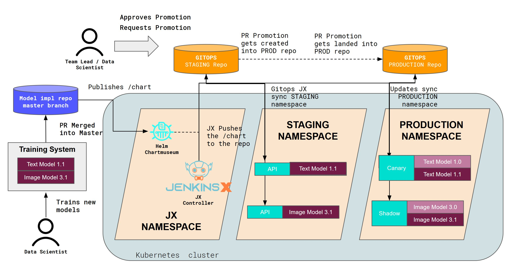

# Seldon Core Deployments 通过 CI / CD 扩容

将 Seldon Core 集成到您的企业堆栈中时，将持续集成和持续交付方法引入部署工作流程是常见做法。

## MLOps 扩缩容

Seldon Core 是考虑到这一点而构建的，目前用于企业大规模支持机器学习的容器化、部署和管理。

本页包含 Seldon Core 用于通过「MLOps」概念持续部署机器学习的概念的高水平概述。

## 示例手册

我们汇集了一组示例，展示了 Seldon Core 如何与 Jenkins Classic、ArgoCD、Jenkins X 集成：

* [CI / CD 集成 Jenkins Classic](../examples/jenkins_classic.html)
* [CI / CD 集成 Jenkins X](../examples/jenkins_x.html)
