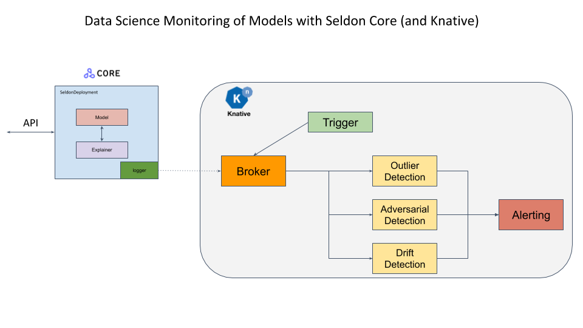

# Seldon Core 的漂移检测

机器学习模型在训练数据分布之外不能很好地进行预测。为了信任并采用模型预估，通过不同类型的检测器监控传入请求的分布至关重要。异常值检测器旨在标记不遵循原始训练分布的单个实例。

[使用 CIFAR10 任务的工作示例](../examples/drift_cifar10.html).

此示例中显示的通用框架是使用 Seldon Core 负载记录器将请求传递给异步处理它们的组件。结果可以继续传递到警报系统。

