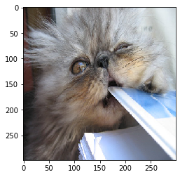

# 模型解释器




我们使用 Seldon [Alibi](https://github.com/SeldonIO/alibi) 开源组件实现模型解释器。

我们推荐通过 python 3.7 进行解释器的保存。然而，对于 v2 协议（使用 MLServer）则不需要此项。

| 包 | 版本 |
| ------ | ----- |
| `alibi` | `0.6.4` |


## 可用方法

Seldon Core 支持的 [Alibi](https://github.com/SeldonIO/alibi) 可用方法子集。包括：


| 方法 | 解释器键 |
|--------|---------------|
| [Anchor Tabular](https://docs.seldon.io/projects/alibi/en/latest/methods/Anchors.html) | `AnchorTabular` |
| [Anchor Text](https://docs.seldon.io/projects/alibi/en/latest/methods/Anchors.html) | `AnchorText` |
| [Anchor Images](https://docs.seldon.io/projects/alibi/en/latest/methods/Anchors.html) | `AnchorImages` |
| [kernel Shap](https://docs.seldon.io/projects/alibi/en/latest/methods/KernelSHAP.html) | `KernelShap` |
| [Integrated Gradients](https://docs.seldon.io/projects/alibi/en/latest/methods/IntegratedGradients.html) | `IntegratedGradients` |
| [Tree Shap](https://docs.seldon.io/projects/alibi/en/latest/methods/TreeSHAP.html) | `TreeShap` |

## 创建解释器

对于需要训练的 Alibi 解释器，您应该

 1. 使用 python 3.7 作为 Seldon python Alibi 解释器封装器在加载解释器时也在 python 3.7.10 中运行。
 2. 遵循 [Alibi 文档](https://docs.seldon.io/projects/alibi/en/latest/index.html)以获取特定所需的解释器。Seldon Wrapper 目前支持：Anchors（表格、文本和图像），KernelShap 和 Integrated Gradients。
 3. 使用 [dill](https://pypi.org/project/dill/) python 包将解释器保存为 `explainer.dill` 并保存到存储桶或集群中的 PVC 上。我们支持 gcs、s3（包括 Minio）或 Azure blob。

[Alibi Explain Server](https://github.com/SeldonIO/seldon-core/tree/master/components/alibi-explain-server) 运行环境使用 [Poetry](https://python-poetry.org/) 锁定。在 [此](../examples/iris_explainer_poetry.html) 查看我们如何使用定义来训练解释器。

### 使用 [MLServer](https://github.com/SeldonIO/MLServer) 的解释器 V2 协议 (孵化中)

对 v2 协议的支持现在由 MLServer 处理。 这是实验性的
并且仅适用于黑盒解释器。

有关 e2e 示例，请在 [这里](../examples/iris_anchor_tabular_explainer_v2.html) 查看 AnchorTabular 笔记本。

## 解释器 API

对于 Seldon 协议，端点路径将被公开为：

```
http://<ingress-gateway>/seldon/<namespace>/<deployment name>/<predictor name>/api/v1.0/explain
```

例如，如果您部署了：

```
apiVersion: machinelearning.seldon.io/v1
kind: SeldonDeployment
metadata:
  name: income
  namespace: seldon
spec:
  name: income
  annotations:
    seldon.io/rest-timeout: "100000"
  predictors:
  - graph:
      children: []
      implementation: SKLEARN_SERVER
      modelUri: gs://seldon-models/sklearn/income/model-0.23.2
      name: classifier
    explainer:
      type: AnchorTabular
      modelUri: gs://seldon-models/sklearn/income/explainer-py36-0.5.2
    name: default
    replicas: 1
```

如果您将端口转发到 localhost:8003 上的 Ambassador，那么 API 调用将是：

```
http://localhost:8003/seldon/seldon/income-explainer/default/api/v1.0/explain
```

tensorflow 和 v2 协议也支持解释方法。完整列表的端点 URI 是：

| Protocol | URI |
| ------ | ----- |
| seldon | `http://<host>/<ingress-path>/api/v1.0/explain` |
| tensorflow | `http://<host>/<ingress-path>/v1/models/<model-name>:explain` |
| v2 | `http://<host>/<ingress-path>/v2/models/<model-name>/infer` |


Note: 对于 `tensorflow` 协议我们支持了一个非标准的 [prediction API](../graph/protocols.md#rest-and-grpc-tensorflow-protocol) 扩展，`http://<host>/<ingress-path>/v1/models/:explain`。
