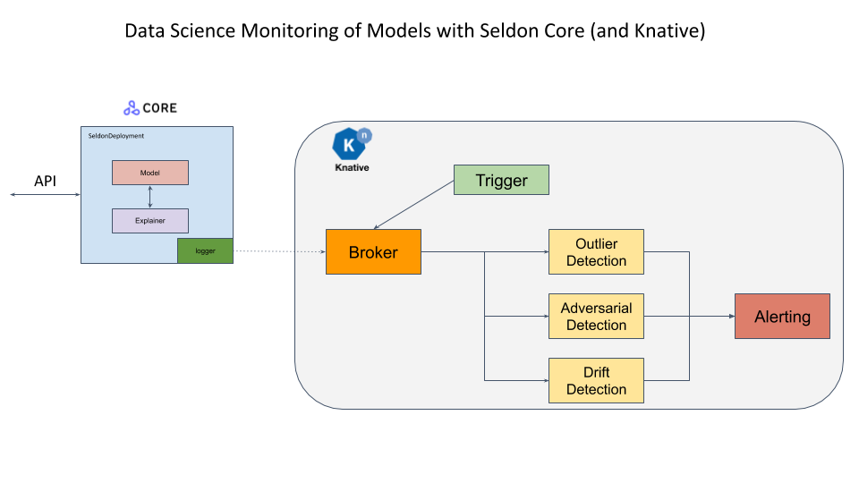

# Seldon Core 中的异常值检测

机器学习模型在训练数据分布之外不能很好地进行预测。为了信任并采用模型预估，通过不同类型的检测器监控传入请求的分布至关重要。异常值检测器旨在标记不遵循原始训练分布的单个实例。

| 包 | 版本 |
| ------ | ----- |
| `alibi-detect` | `0.9.0` |

可用的 [CIFAR10 任务示例](../examples/outlier_cifar10.html)。此示例侧重于服务基础架构并对其进行详细讨论。

实例中的基础框架使用 Seldon Core 有效负载记录器将请求传递给异步处理它们的组件。结果可以继续传递给告警系统。

## 创建自己的检测器

对于需要训练的 Alibi Detect 异常值检测器，您应该

 1. 使用 python 3.7 作为 Seldon Alibi 检测服务端，同时也使用 python 3.7.10 加载你的检测器。
 1. 跟随 [Alibi Detect 文档](https://docs.seldon.io/projects/alibi-detect/en/stable/) 了解您所需的特定检测器。
 1. 使用 [save_detector](https://docs.seldon.io/projects/alibi-detect/en/stable/overview/saving.html) 保存你的检测器方法并且到集群的对象存储或者 PVC 中。我们在 [init container](../servers/overview.html) 支持了一些云存储解决方案。

我们的 [Alibi 解释检测器](https://github.com/SeldonIO/seldon-core/tree/master/components/alibi-detect-server) 运行时环境通过 [Poetry](https://python-poetry.org/) 锁定。查看 [这里的](../examples/cifar10_od_poetry.html) e2e 文档来使用该定义训练你的检测器。
