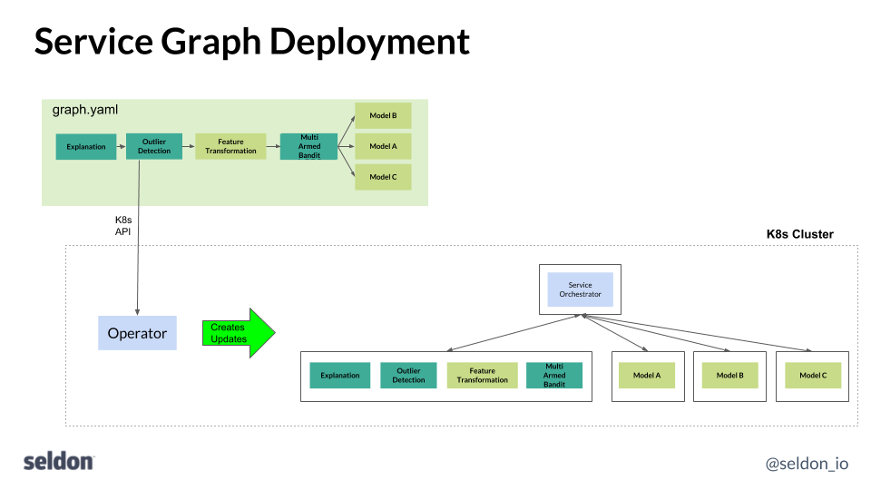
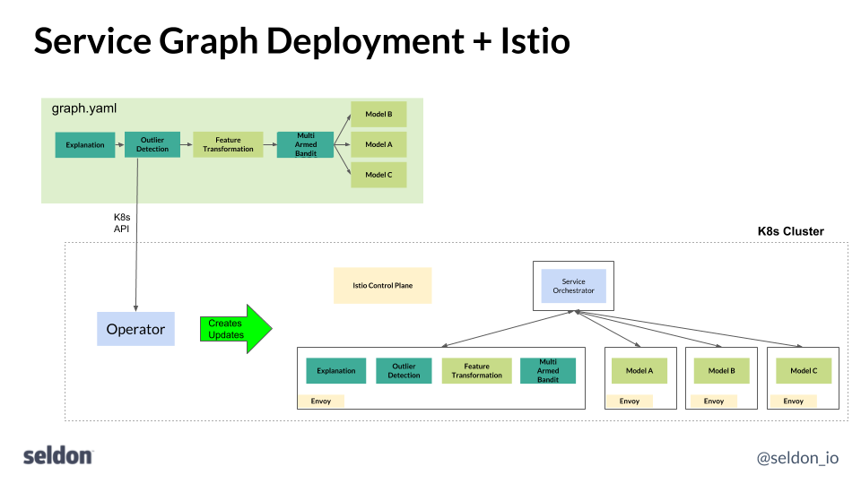

# Istio 和 Seldon

[Istio](https://istio.io/) 提供了服务网格功能，对于 Seldon 提供额外的流量管理，和你的机器学习部署图提供了端到端加密和策略执行，是个非常有用的功能。Seldon-core 可以看作是为机器学习部署提供了一个服务图。作为其中的一部分，它提供了一个操作器（Operator），该操作器将您的机器学习部署图定义转换为 SeldonDeployment Kubernete s资源，并在 Kubernetes 集群上进行部署和管理，以便您可以连接需要访问机器学习服务的业务应用程序。数据科学家专注于构建可插拔的 docker 容器作为他们机器学习图运行时的一部分，如预估运行时，转换器（transformations），异常检测，集合器（ensemblers）等。这些可以根据需要组合在一起，以满足你的 ML 运行时。为了允许在不知道它们所存在的服务图的情况下构建模块，Seldon 还部署了一个服务编排器作为每个部署的一部分，该编排器管理请求/响应流程，以满足多组件图中定义的机器学习服务图。

组件说明在下面。用户的图资源定义 (graph.yaml) 通过 Kubernetes API 发布，Seldon Operator 管理潜在的组件创建和更新，包括 Seldon 通过部署图管理着请求/响应逻辑流。

开箱即用，Seldon 通过 Kubernetes 的潜在功能提供 SeldonDeployment 服务图的滚动更新。然而，在某些情况下，您希望通过细粒度流量管理以更可控的方式管理ML部署的更新，包括金丝雀更新、蓝绿色部署和影子流量。这就是 Istio 结合 Seldon 的帮忙之处。

Istio 的添加是对 Seldon 的补充，如下所示，其中 Envoy sidecar 被注入到定义的 Kubernetes Deployments 中，用户可以使用 Istio 控制平面管理服务网格。

