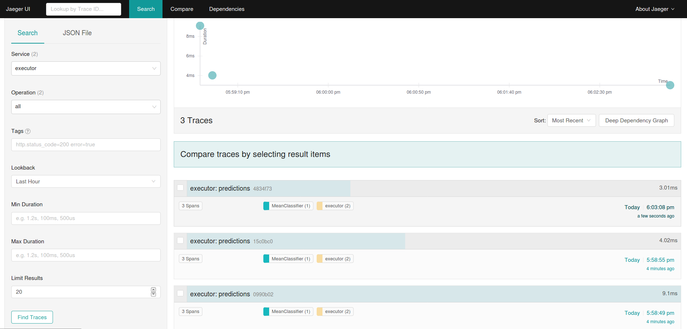
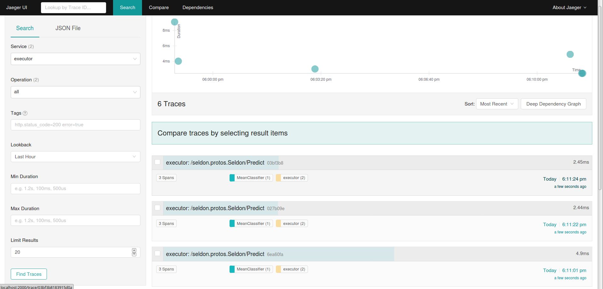

# 分布式追踪

可以打开 Tracing 来追踪 API 到 Seldon Core 的调用。默认我们提供 Jaeger 来进行分布式追踪。这将允许您在 Seldon 部署中获得有关每个微服务跳的延迟和性能的监控。

## 安装 Jaeger

需要再 Kubernetes 集群安装 Jaeger。请参考他们的 [文档](https://www.jaegertracing.io/docs/1.18/operator/)。

## 配置

您需要用环境变量注释您的 Seldon 部署资源，以便进行主动跟踪并设置适当的 Jaeger 配置变量。

  * 对于 Seldon 服务编排，你需要在 `spec.predictors[].svcOrchSpec.env` 节点设置环境变量。查看 [Jaeger Java 文档](https://github.com/jaegertracing/jaeger-client-java/tree/master/jaeger-core#configuration-via-environment)来配置可用的参数变量。
  * 对于每个运行的 Seldon component（如：模型转换器等）需要为容器节点添加环境变量。


### Python 封装配置

添加环境变量：值为 1 的 TRACING 激活追踪。

您可以通过提供JAEGER_AGENT_HOST环境变量，只需提供 Jaeger 代理服务的名称即可使用默认配置。覆盖默认的 JAEGER_AGENT_PORT 设置 Jaeger 代理端口 `5775`。

根据[此处](https://github.com/jaegertracing/jaeger-client-python)提供的Jaeger Python 配置 yaml 来自定义设置，你可以通过 JAEGER_CONFIG_PATH 环境变量指向的 YAML 文件提供一个配置对象。

示例：

```yaml
apiVersion: machinelearning.seldon.io/v1
kind: SeldonDeployment
metadata:
  name: tracing-example
  namespace: seldon
spec:
  name: tracing-example
  predictors:
  - componentSpecs:
    - spec:
        containers:
        - env:
          - name: TRACING
            value: '1'
          - name: JAEGER_AGENT_HOST
            valueFrom:
              fieldRef:
                fieldPath: status.hostIP
          - name: JAEGER_AGENT_PORT
            value: '5775'
          - name: JAEGER_SAMPLER_TYPE
            value: const
          - name: JAEGER_SAMPLER_PARAM
            value: '1'
          image: seldonio/mock_classifier_rest:1.3
          name: model1
        terminationGracePeriodSeconds: 1
    graph:
      children: []
      endpoint:
        type: REST
      name: model1
      type: MODEL
    name: tracing
    replicas: 1
    svcOrchSpec:
      env:
      - name: TRACING
        value: '1'
      - name: JAEGER_AGENT_HOST
        valueFrom:
          fieldRef:
            fieldPath: status.hostIP
      - name: JAEGER_AGENT_PORT
        value: '5775'
      - name: JAEGER_SAMPLER_TYPE
        value: const
      - name: JAEGER_SAMPLER_PARAM
        value: '1'
```
        


## REST 示例



## gRPC 示例




## 可用示例

你可以参考并动手尝试以下示例：

我们提供的[完全可工作的模板示例](../examples/tracing.html)。
