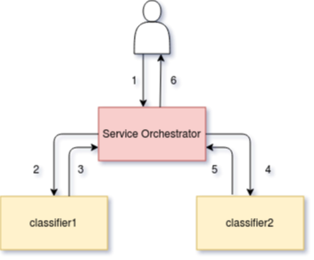

# 服务编排

服务编排器是一个
作为 sidecar 容器添加到推理图中的组件。
其主要职责是：

- 正确管理推理图描述的请求/响应路径。
- 公开 Prometheus 指标。
- 通过开放追踪提供追踪。
- 添加基于 CloudEvent 的负载日志记录。

从 Seldon Core `>=1.1` 开始，
服务编排器允许您为推理图的数据平面指定协议。
目前，我们支持以下协议：

| 协议 | `SeldonDeployment` 键 | 参考 | 
| ---- | ---- | ---- | 
| Seldon | `seldon` | [OpenAPI spec for Seldon](https://docs.seldon.io/projects/seldon-core/en/latest/reference/apis/openapi.html) |
| Tensorflow | `tensorflow` | [REST API](https://www.tensorflow.org/tfx/serving/api_rest) and [gRPC API](https://github.com/tensorflow/serving/blob/master/tensorflow_serving/apis/prediction_service.proto) reference |
| V2 | `v2` | [KServe Dataplane reference](https://github.com/kserve/kserve/tree/master/docs/predict-api/v2) |

我们的一些开箱即用的预封装服务器支持这些协议。您可以查看
他们的
你可以检查他们的
[文档](https://docs.seldon.io/projects/seldon-core/en/latest/servers/overview.html)
获取更多信息。

此外，您可以在 [协议示例笔记](../examples/protocol_examples.html)查看
一节基础的配置示例。

## 设计

服务编排器的核心关注点是通过定义的推理图管理调用的请求/响应流。
给出如下图所示：

```YAML
apiVersion: machinelearning.seldon.io/v1
kind: SeldonDeployment
metadata:
  name: fixed
spec:
  name: fixed
  protocol: seldon
  transport: rest
  predictors:
  - componentSpecs:
    - spec:
        containers:
        - image: seldonio/fixed-model:0.1
          name: classifier1
        - image: seldonio/fixed-model:0.1
          name: classifier2
    graph:
      name: classifier1
      type: MODEL
      children:
      - name: classifier2
        type: MODEL
    name: default
    replicas: 1
```

服务编排器组件被添加到图中并管理请求流，如下所示：



初始请求 (1) 到达服务编排器，然后将其转发到第一个模型 (2) 并且被服务编排器 (3) 捕获响应，然后转发到第二个模型 (4)，然后服务编排器再次捕获响应(5) 在返回之前给调用者 (6) 。

对于更复杂的推理图，服务协调器将处理路由组件，这些路由组件可以决定子组件子集中的哪个子组件发送请求或聚合组件以组合来自多个组件的响应。


## 服务编排的资源请求/限制

您可以通过 `svcOrchSpec` 
在您的 Seldon 部署中为组件设置自定义资源请求和限制。
下面显示了一个设置引擎 cpu 和内存请求的示例：

```JSON
{
  "apiVersion": "machinelearning.seldon.io/v1alpha2",
  "kind": "SeldonDeployment",
  "metadata": {
    "name": "svcorch"
  },
  "spec": {
    "name": "resources",
    "predictors": [
      {
        "componentSpecs": [
          {
            "spec": {
              "containers": [
                {
                  "image": "seldonio/mock_classifier:1.0",
                  "name": "classifier"
                }
              ]
            }
          }
        ],
        "graph": {
          "children": [],
          "name": "classifier",
          "type": "MODEL",
          "endpoint": {
            "type": "REST"
          }
        },
        "svcOrchSpec": {
          "resources": {
            "requests": {
               "cpu": "1",
               "memory": "3Gi"
            }
          }
        },
        "name": "release-name",
        "replicas": 1
      }
    ]
  }
}

```

## 绕过服务协调器（版本 >= 0.5.0）

如果您正在部署单个模型，对于希望将其部署模型的延迟和资源使用降至最低的人，您可以选择不包含服务协调器。为此，将注释 `seldon.io/no-engine: "true"` 添加到预测器。预测器必须只包含一个节点图。一个例子如下所示：

```YAML
apiVersion: machinelearning.seldon.io/v1alpha2
kind: SeldonDeployment
metadata:
  labels:
    app: seldon
  name: noengine
spec:
  name: noeng
  predictors:
  - annotations:
      seldon.io/no-engine: "true"
    componentSpecs:
    - spec:
        containers:
        - image: seldonio/mock_classifier_rest:1.3
          name: classifier
    graph:
      children: []
      endpoint:
        type: REST
      name: classifier
      type: MODEL
    name: noeng
    replicas: 1
```

在这些情况下，外部 API 请求将直接发送到您的模型。目前只有 python 封装器 (>=0.13-SNAPSHOT) 已被修改以允许这样做。

请注意，请求中不会添加任何指标或额外数据，因此如果需要，这需要由您的模型本身完成。

## 路由元数据注入

出于性能原因，默认情况下，服务编排器只会转发请求有效负载，
而不会尝试对其进行反序列化。
对于某些用例，这可能是一个障碍，如
[注入路由到推理图](../analytics/routers.md)。
此元数据可用于指示
每个请求采用了哪些路由。

可通过设置编排器 `SELDON_ENABLE_ROUTING_INJECTION` 
环境变量来改变。
当变量修改后 (在 `svcOrchSpec`)，
编排器将解释请求有效负载，
并为每个请求注入此路由元数据。

您可以在下面看到有关如何打开此标志的示例：

```yaml
apiVersion: machinelearning.seldon.io/v1
kind: SeldonDeployment
metadata:
  name: my-graph-with-routers 
spec:
  predictors:
  - svcOrchSpec:
      env:
      - name: SELDON_ENABLE_ROUTING_INJECTION
        value: 'true'
    graph:
      name: router
      type: ROUTER 
      # ...
      children: 
        - name: model-a
          type: MODEL
          # ...
        - name: model-b
          type: MODEL
          # ...
    name: default
```

