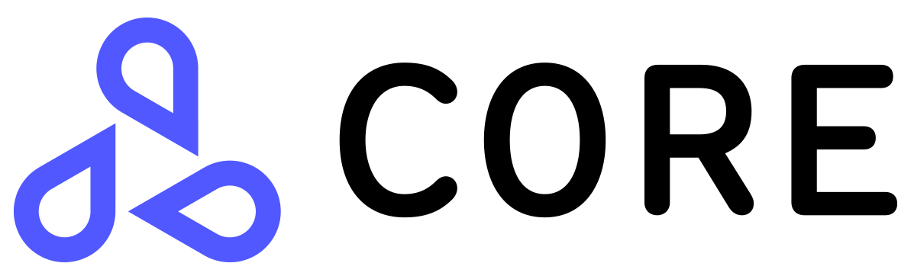

===========
Seldon Core
===========

.. 这是一个隐藏链接不会被任何地方引用，但是会
   通过 readthedocs 暴露到 URL
.. TODO Filter through these to remove or ignore old ones

一个可大规模地在 Kubernetes 上部署机器学习模型的开源平台。

概述
--------

Seldon Core 将你的机器学习模型（Tensorflow, Pytorch, H2o等）或（Python, Java等）语言封装转换为生产环境 REST/GRPC 微服务。

Seldon 处理着成千上万的生产环境机器学习模型实例，并提供先进的开箱即用的能力，包括高级指标，访问记录，解释器，异常值检测，AB测试，金丝雀发布等特性。

快速链接
--------

* 加入社区 `Slack 社区 <https://join.slack.com/t/seldondev/shared_invite/zt-vejg6ttd-ksZiQs3O_HOtPQsen_labg>`_ 来讨论问题
* 从 `Seldon Core Notebook 示例 <./examples/notebooks.html>`_ 开始
* 加入我们每两周一次的 `线上讨论会 </developer/community.html#community-calls>_ （`Google 日历 <https://calendar.google.com/event?action=TEMPLATE&tmeid=MXBtNzI1cjk0dG9kczhsZTRkcWlmcm1kdjVfMjAyMDA3MDlUMTUwMDAwWiBzZWxkb24uaW9fbTRuMnZtcmZubDI3M3FsczVnYjlwNjVpMHNAZw&tmsrc=seldon.io_m4n2vmrfnl273qls5gb9p65i0s%40group.calendar.google.com&scp=ALL>`_，`iCal <https://calendar.google.com/calendar/ical/seldon.io_m4n2vmrfnl273qls5gb9p65i0s%40group.calendar.google.com/public/basic.ics>`_）
* 学习如何开始参与 `社区贡献 <./developer/contributing.html>`_
* 查看 `博客 <./tutorials/blogs.html>`_ 深入了解 Seldon 核心组件
* 观看使用 Seldon 核心的 `视频和讨论 <./tutorials/videos.html>`_

.. toctree::
   :hidden:
   
   开始 </nav/getting-started.rst>
   概念 </nav/concepts.rst>
   配置 </nav/configuration.rst>
   教程 </nav/tutorials.rst>
   参考 <nav/reference.rst>
   贡献 </nav/contributing.rst>