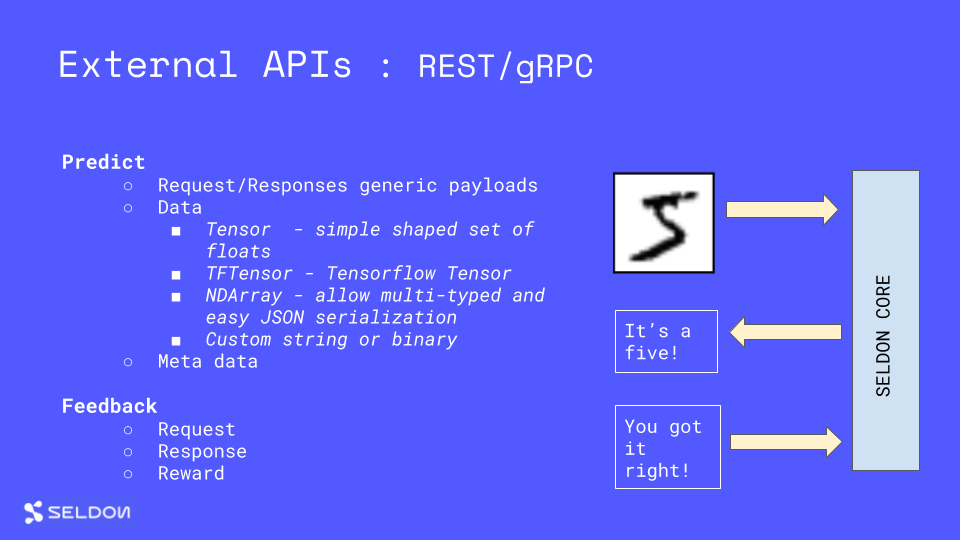

# 外部预估 API



Seldon Core 公开了一个通用的外部 API，以将您的 ML 运行时预测连接到外部业务应用程序。

## REST API

### 预估

 - endpoint : POST /api/v1.0/predictions
 - payload : `SeldonMessage` JSON 表示 - 查看 [proto 定义](./prediction.md#proto-buffer-and-grpc-definition)
 - 示例 payload :

   ```json
   {"data":{"names":["a","b"],"tensor":{"shape":[2,2],"values":[0,0,1,1]}}}
   ```

### 反馈

 - endpoint : POST /api/v1.0/feedback
 - payload : `Feedback` JSON 表示 - 查看 [proto 定义](./prediction.md#proto-buffer-and-grpc-definition)

### 元数据 - Graph 级别

- endpoint : GET /api/v1.0/metadata
- 响应示例：

```json
{
  "name": "example",
  "models": {
    "model-1": {
      "name": "Model 1",
      "platform": "platform-name",
      "versions": ["model-version"],
      "inputs": [{"datatype": "BYTES", "name": "input", "shape": [1, 5]}],
      "outputs": [{"datatype": "BYTES", "name": "output", "shape": [1, 3]}]
    },
    "model-2": {
      "name": "Model 2",
      "platform": "platform-name",
      "versions": ["model-version"],
      "inputs": [{"datatype": "BYTES", "name": "input", "shape": [1, 3]}],
      "outputs": [{"datatype": "BYTES", "name": "output", "shape": [3]}]
    }
  },
  "graphinputs": [{"datatype": "BYTES", "name": "input", "shape": [1, 5]}],
  "graphoutputs": [{"datatype": "BYTES", "name": "output", "shape": [3]}]
}
```

查看元数据[文档](./metadata.md)细节。


### 元数据 - Model 级别

- endpoint : GET /api/v1.0/metadata/{MODEL_NAME}
- 响应示例：

```json
{
  "name": "Model 1",
  "versions": ["model-version"],
  "platform": "platform-name",
  "inputs": [{"datatype": "BYTES", "name": "input", "shape": [1, 5]}],
  "outputs": [{"datatype": "BYTES", "name": "output", "shape": [1, 3]}],
}
```

查看元数据[文档](./metadata.md)细节。


## gRPC

```protobuf
service Seldon {
  rpc Predict(SeldonMessage) returns (SeldonMessage) {};
  rpc SendFeedback(Feedback) returns (SeldonMessage) {};
  rpc ModelMetadata(SeldonModelMetadataRequest) returns (SeldonModelMetadata) {};
  rpc GraphMetadata(google.protobuf.Empty) returns (SeldonGraphMetadata) {};
}
```

查看 [proto 定义](./prediction.md#proto-buffer-and-grpc-definition)
