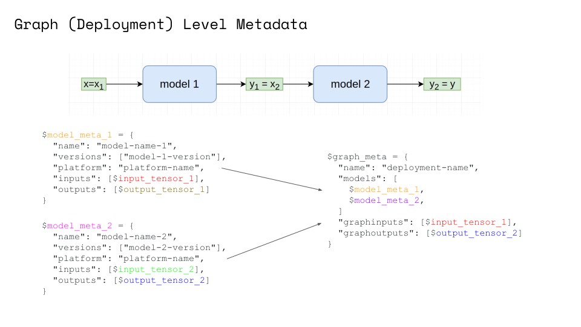

# 模型和元数据发布


## 示例

### 基础示例
- [简单元数据示例](../../examples/metadata.html)
- [复杂图元数据示例](../../examples/graph-metadata.html)
- [元数据 GRPC API 示例](../../examples/metadata_grpc.html)
- [元数据架构和验证](../../examples/metadata_schema.html)

### 元数据在框架中的实现

- [基于 MinIO 的 SKLearn Server 示例](../../examples/minio-sklearn.html)
- [发布使用 Pachyderm 训练的模型](../../examples/pachyderm-simple.html)
- [发布使用 DVC 训练的模型](../../examples/dvc.html)


## 模型元数据

在 Seldon 中，你可以轻易的为模型添加元数据。

### 预封装模型服务器

要添加元数据到预封装模型服务器中，只需简单的将 `metadata.yaml` 添加到存储你模型的 S3 存储桶中：
```YAML
name: my-model
versions: [my-model/v1]
platform: platform-name
inputs:
- messagetype: tensor
  schema:
    names: [a, b, c, d]
    shape: [4]
outputs:
- messagetype: tensor
  schema:
    shape: [ 1 ]
custom:
  author: seldon-dev
  extra: information
```

查看[基于 MinIO 的 SKLearn Server 示例](../../examples/minio-sklearn.html)获取更多信息。

### Python 语言封装

你可以实现 `init_metadata` 方法来添加元数据到你自定义的 Python 模型：

```python
class Model:
    ...
    def init_metadata(self):
        meta = {
            "name": "my-model-name",
            "versions": ["my-model-version-01"],
            "platform": "seldon",
            "inputs": [
                {
                    "messagetype": "tensor",
                    "schema": {"names": ["a", "b", "c", "d"], "shape": [4]},
                }
            ],
            "outputs": [{"messagetype": "tensor", "schema": {"shape": [1]}}],
            "custom": {"author": "seldon-dev", "extra": "information"},
        }
        return meta
```

查看 [Python wrapper](../../python/python_component.html#incubating-features) 文档获取更多信息，以及参考[包含元数据的模型基础示例](../../examples/metadata.html) notebook。

### 通过环境变量覆盖

也可定义 `MODEL_METADATA` 有更高优先级的环境变量。

```YAML
apiVersion: machinelearning.seldon.io/v1
kind: SeldonDeployment
metadata:
  name: seldon-model
spec:
  name: test-deployment
  predictors:
  - componentSpecs:
    - spec:
        containers:
        - name: my-model
          image: ...
          env:
          - name: MODEL_METADATA
            value: |
              ---
              name: my-model-name
              versions: [ my-model-version ]
              platform: seldon
              inputs:
              - messagetype: tensor
                schema:
                  names: [a, b, c, d]
                  shape: [4]
              outputs:
              - messagetype: tensor
                schema:
                  shape: [ 1 ]
              custom:
                author: seldon-dev
                extra: information
    graph:
      name: my-model
      ...
    name: example
    replicas: 1
```


## 元数据开发
模型元数据允许你在你的图中为每个组件（节点）定义特殊的元数据。
新的编排引擎会自动探测所有节点的元数据并为你的图派生全局的 `inputs` 和 `outputs`。
然后，他会在你的发布中将所有节点的元数据暴露在单一节点的 `/api/v1.0/metadata/`。


返回值示例：
```json
{
    "name": "example",
    "models": {
        "node-one": {
            "name": "node-one",
            "platform": "seldon",
            "versions": ["generic-node/v0.3"],
            "inputs": [
                {"messagetype": "tensor", "schema": {"names": ["one-input"]}}
            ],
            "outputs": [
                {"messagetype": "tensor", "schema": {"names": ["one-output"]}}
            ],
            "custom": {"author": "seldon-dev", "extra": "information"}
        },
        "node-two": {
            "name": "node-two",
            "platform": "seldon",
            "versions": ["generic-node/v0.3"],
            "inputs": [
                {"messagetype": "tensor", "schema": {"names": ["two-input"]}}
            ],
            "outputs": [
                {"messagetype": "tensor", "schema": {"names": ["two-output"]}}
            ],
            "custom": {"author": "seldon-dev", "extra": "information"}
        }
    },
    "graphinputs": [
        {"messagetype": "tensor", "schema": {"names": ["one-input"]}}
    ],
    "graphoutputs": [
        {"messagetype": "tensor", "schema": {"names": ["two-output"]}}
    ]
}
```

查看示例 [notebook](../../examples/graph-metadata.html) 获取更多信息。


## 元数据节点

在部署节点可以通过 GET 请求 `/api/v1.0/metadata/{MODEL_NAME}` 获取模型元数据。

返回值示例：
```json
{
  "name": "my-model",
  "versions": ["my-model/v1"],
  "platform": "platform-name",
  "inputs": [{"messagetype": "tensor", "schema": {"shape": [1, 5]}}],
  "outputs": [{"messagetype": "tensor", "schema": {"shape": [1, 3]}}],
  "custom": {"author": "seldon-dev", "extra": "information"}
}
```


## 深入：SeldonMessage 和 kfserving 元数据参考

可为你模型的元数据 inputs/outputs 通过两种格式进行定义：
- `v1` 格式，与当前 `SeldonMessage` 格式相近。
- `v2` 格式，是面向未来的，完全与 [kfserving dataplane proposal](https://github.com/kubeflow/kfserving/blob/master/docs/predict-api/v2/required_api.md#model-metadata) 兼容。

通常大多数字段可通过 [kfserving dataplane proposal](https://github.com/kubeflow/kfserving/blob/master/docs/predict-api/v2/required_api.md#model-metadata) 来定义模型元数据，你也可以定义额外的 `custom` 参数，它允许你定义任何你觉得有价值的内容。`custom` 字段是以字符串 `string` 保存的 kv 结构的字典。

查看 [元数据架构和验证](../../examples/metadata_schema.html) notebook。

### SeldonMessage 元数据

#### ndarray 输入/输出
```YAML
name: my-model-name
versions: [ my-model-version-01 ]
platform: seldon
inputs:
- messagetype: ndarray
  schema:
    names: [a, b]
    shape: [ 2, 2 ]
outputs:
- messagetype: ndarray
  schema:
    shape: [ 1 ]
custom:
  author: seldon-dev
  extra: information
```

这个元数据标识模型需要按照以下两种输入是可验证的：
```JSON
{"data": {"names": ["a", "b"], "ndarray": [[1, 2], [3, 4]]}}
```

注意：针对 `tensor` 和 `tftensor` 消息类型的格式相同。

#### jsonData input/output
```YAML
name: my-model-name
versions: [ my-model-version-01 ]
platform: seldon
inputs:
- messagetype: jsonData
  schema:
      type: object
      properties:
          my-names:
              type: array
              items:
                  type: string
          my-data:
            type: array
            items:
                type: number
                format: double
outputs:
- messagetype: ndarray
  schema:
    shape: [ 1 ]
custom:
  author: seldon-dev
  extra: information
```

模型输入示例：
```JSON
{"jsonData": {"my-names": ["a", "b", "c"], "my-data": [1.0, 4.2, 3.14]}}
```

`schema` 字段可选，并再结构上是自由的。

注意：正如您所看到的，您可以混合不同类型的输入和输出！

#### strData 输入/输出
```YAML
name: my-model-name
versions: [ my-model-version-01 ]
platform: seldon
inputs:
- messagetype: strData
outputs:
- messagetype: strData
custom:
  author: seldon-dev
  extra: information
```

示例模型输入：
```JSON
{"strData": "some test input"}
```

#### 自定义输入/输出格式

您还可以指定您的自定义 `messagetype`。在这种情况下，您在 `schema` 下定义的字段没有限制。这对 `raw` 方法可能有用。

```YAML
name: my-model-name
versions: [ my-model-version-01 ]
platform: seldon
inputs:
- messagetype: customData
  schema:
    my-names: ["a", "b", "c"]
outputs:
- messagetype: tensor
  schema:
    shape: [ 1 ]
custom:
  author: seldon-dev
  extra: information
```


### kfserving TensorMetadata

你可以轻易的为模型定义与 [kfserving dataplane proposal](https://github.com/kubeflow/kfserving/blob/master/docs/predict-api/v2/required_api.md#model-metadata) 兼容的元数据。
```javascript
$metadata_model_response =
{
  "name" : $string,
  "versions" : [ $string, ... ], // optional
  "platform" : $string,
  "inputs" : [ $metadata_tensor, ... ],
  "outputs" : [ $metadata_tensor, ... ]
}
```
与
```javascript
$metadata_tensor =
{
  "name" : $string,
  "datatype" : $string,
  "shape" : [ $number, ... ]
}
```

示例定义
```YAML
name: my-model-name
versions: [ my-model-version-01 ]
platform: seldon
inputs:
- datatype: BYTES
  name: input
  shape: [ 1, 4 ]
outputs:
- datatype: BYTES
  name: output
  shape: [ 3 ]
```
