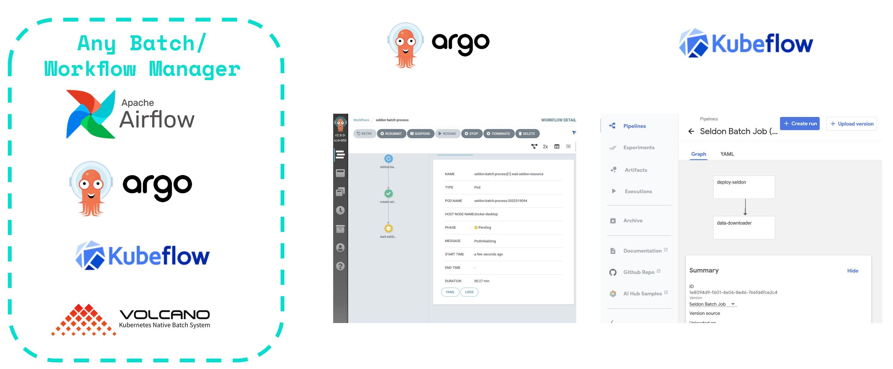

# Seldon Core 批处理

Seldon Core 提供了一个命令行组件，允许使用水平可扩展的 Seldon 核心 kubernetes 模型部署进行高度并行化的批处理。 

流处理请查看[基于 KNative 事件的流处理](../streaming/knative_eventing.md)。


## 水平可扩展的 Workers 和副本

可并行化的批处理器工作线程允许高吞吐量，因为它能够利用 Seldon Core 水平扩展副本以及自动扩展，从而为用户提供灵活性以根据需要优化他们的配置。 

下图显示了一个标准工作流程，其中可以下载数据然后通过对象存储上传，并且可以在作业成功完成后创建和删除 Seldon 模型。


## 与 ETL 和工作流管理器集成

Seldon 批处理组件已构建为模块化和灵活化的，因此它可以跨任何工作流管理器进行集成。

这允许您在大量批处理应用程序上利用 Seldon，包括必须按计划发生的触发器（例如，每天一次、每月一次等），或可以以编程方式触发的作业。



## 动手实例

我们提供了一组示例，向您展示如何使用 Seldon 批处理组件：

* [使用 Argo 工作流和 S3 / Minio 进行批处理](../examples/argo_workflows_batch.html)
* [使用 Argo 工作流和 HDFS 进行批处理](../examples/argo_workflows_hdfs_batch.html)
* [使用 Kubeflow 流水线示例进行批处理](../examples/kubeflow_pipelines_batch.html)

## 高级实现细节

### 命令行参数

要获得有关每个可用命令的更多信息，您可以按如下方式与批处理器组件交互：

```bash
$ seldon-batch-processor --help

Usage: seldon-batch-processor [OPTIONS]

  Command line interface for Seldon Batch Processor, which can be used to send
  requests through configurable parallel workers to Seldon Core models. It is
  recommended that the respective Seldon Core model is also optimized with
  number of replicas to distribute and scale out the batch processing work.
  The processor is able to process data from local filestore input file in
  various formats supported by the SeldonClient module. It is also suggested
  to use the batch processor component integrated with an ETL Workflow Manager
  such as Kubeflow, Argo Pipelines, Airflow, etc. which would allow for extra
  setup / teardown steps such as downloading the data from object store or
  starting a seldon core model with replicas. See the Seldon Core examples
  folder for implementations of this batch module with Seldon Core.

Options:
  -d, --deployment-name TEXT      The name of the SeldonDeployment to send the
                                  requests to  [required]
  -g, --gateway-type [ambassador|istio|seldon]
                                  The gateway type for the seldon model, which
                                  can be through the ingress provider
                                  (istio/ambassador) or directly through the
                                  service (seldon)
  -n, --namespace TEXT            The Kubernetes namespace where the
                                  SeldonDeployment is deployed in
  -h, --host TEXT                 The hostname for the seldon model to send
                                  the request to, which can be the ingress of
                                  the Seldon model or the service itself
  -t, --transport [rest|grpc]     The transport type of the SeldonDeployment
                                  model which can be REST or GRPC
  -a, --data-type [data|json|str|raw]
                                  Whether to use json, strData or Seldon Data
                                  type for the payload to send to the
                                  SeldonDeployment which aligns with the
                                  SeldonClient format
  -p, --payload-type [ndarray|tensor|tftensor]
                                  The payload type expected by the
                                  SeldonDeployment and hence the expected
                                  format for the data in the input file which
                                  can be an array
  -w, --workers INTEGER           The number of parallel request processor
                                  workers to run for parallel processing
  -r, --retries INTEGER           The number of retries for each request
                                  before marking an error
  -i, --input-data-path PATH      The local filestore path where the input
                                  file with the data to process is located
  -o, --output-data-path PATH     The local filestore path where the output
                                  file should be written with the outputs of
                                  the batch processing
  -m, --method [predict|feedback]
                                  The method of the SeldonDeployment to send
                                  the request to which currently only supports
                                  the predict method
  -l, --log-level [debug|info|warning|error]
                                  The log level for the batch processor
  -b, --benchmark                 If true the batch processor will print the
                                  elapsed time taken to run the process
  -u, --batch-id TEXT             Unique batch ID to identify all data points
                                  processed in this batch, if not provided is
                                  auto generated
  -s, --batch-size INTEGER        Batch size greater than 1 can be used to
                                  group multiple predictions into a single
                                  request.
  -t, --batch-interval FLOAT      Minimum Time interval (in seconds) between
                                  batch predictions made by every worker.
  --use-ssl BOOLEAN               Whether to use https rather than http as the
                                  REST transport protocol.
  --call-credentials-token TEXT   Auth token used by Seldon Client, if
                                  supplied and using REST the transport
                                  protocol will be https.
  --ssl-verify BOOLEAN            Can be set to false to avoid SSL
                                  verification in REST.
  --help                          Show this message and exit.
```

### 身份标识

发送到 Seldon 核心模型的每个数据点在请求元数据中包含以下标识符：
* Batch ID - 可以通过 CLI 提供或自动生成的唯一标识符
* Batch Instance ID - 为每个处理的数据点生成的唯一标识符
* Batch Index -  数据点相对于输入文件位置的本地有序降序索引

这些标识符按如下方式添加到每个请求中：

```javascript
seldon_request = {
    <data>: <current_batch_instance>,
    "meta": {
        "tags": {
            "batch_id": <BATCH_ID>
            "batch_instance_id": <BATCH_INSTANCE_ID>
            "batch_index": <BATCH_INDEX>
            }
        }
    }
```

这允许识别请求并将其与数据中的初始请求进行匹配。

### 表现

该模块的实现是利用 Python 的线程系统完成的。

基准测试是使用普通 Python 请求模块进行的，以评估 Threading、Twisted 和 AsyncIO 的性能。结果显示 Asyncio 的性能更好，但是考虑到工作程序中的逻辑非常少（即发送请求）并且大部分时间都在等待响应，使用 Python 的本机线程的实现能够以最快的速度执行足够高效，可以很容易地扩展到数千工作器。

然而，目前的实现使用 Seldon 客户端，它没有利用很多优化要求来提高处理性能，例如重用 requests.py 会话。然而，即使没有这些优化，worker 仍将达到高度并发的性能，并且这些优化将随着该组件（和反馈）的采用率的增长而引入。

### 微批量

使用批处理器 CLI 时，您可以指定一个 `batch-size` 参数，该参数可以将多个预测分组到单个请求中。这使您可以利用为某些模型提供的更高性能，并减少网络开销。响应将被拆分回多个单个预测响应，以便输出文件看起来与运行批处理大小为 1 的处理器相同。

目前我们只支持微批处理`ndarray`和`tensor`有效载荷类型。


### 输入文件格式

#### 数据类型: data

默认数据格式是 `ndarray` 负载类型的 `data`。`input.data` 文件看起来如下示例
```yaml
[[1, 2, 3]]
[[4, 5, 6]]
[[7, 8, 9]]
[[1, 3, 6]]
```
输入文件中的每一行代表一个推理请求实例。 这些将被发送到模型如下
```yaml
{"data": {"ndarray": [[1, 2, 3]]}, "meta": {"tags": {"batch_index": 0, "batch_id": ..., "batch_instance_id": ...}}}
{"data": {"ndarray": [[4, 5, 6]]}, "meta": {"tags": {"batch_index": 1, "batch_id": ..., "batch_instance_id": ...}}}
{"data": {"ndarray": [[7, 8, 9]]}, "meta": {"tags": {"batch_index": 2, "batch_id": ..., "batch_instance_id": ...}}}
{"data": {"ndarray": [[1, 3, 6]]}, "meta": {"tags": {"batch_index": 3, "batch_id": ..., "batch_instance_id": ...}}}
```

选择 `tensor` 负载类型会将有效结果发送到模型
```yaml
{"data": {"tensor": {"shape": [1, 3], "values": [1, 2, 3]}}, "meta": ...}
{"data": {"tensor": {"shape": [1, 3], "values": [4, 5, 6]}}, "meta": ...}
{"data": {"tensor": {"shape": [1, 3], "values": [7, 8, 9]}}, "meta": ...}
{"data": {"tensor": {"shape": [1, 3], "values": [1, 3, 6]}}, "meta": ...}
```


#### 数据类型: raw

如果数据类型被指定为 `raw`，那么输入文件中的每一行都将按原样发送到模型。
在这种情况下，负载类型设置将被忽略。

当不使用微批处理时，每一行将被理解为独立的 SeldonMessage 并按原样发送到模型，包括 `meta.tags` 信息。

如果使用微批处理，则每个「原始」输入必须代表 `ndarray` 或 `tensor` 有效负载类型，并且仅包含单个推理请求。 在这种情况下，用户提供的标签不会发送到模型。 然而，它们将被合并到响应中并写入输出文件。

Example raw `input.data` may look like this for example
```yaml
{"data": {"names": ["a", "b", "c"], "ndarray": [[1, 2, 3]]}, "meta": {"tags": {"customer-id": 0}}}
{"data": {"names": ["a", "b", "c"], "ndarray": [[4, 5, 6]]}, "meta": {"tags": {"customer-id": 1}}}
{"data": {"names": ["a", "b", "c"], "ndarray": [[7, 8, 9]]}, "meta": {"tags": {"customer-id": 2}}}
{"data": {"names": ["a", "b", "c"], "ndarray": [[1, 3, 6]]}, "meta": {"tags": {"customer-id": 3}}}
```

查看 [#3702](https://github.com/SeldonIO/seldon-core/issues/3702) 获取额外信息。
