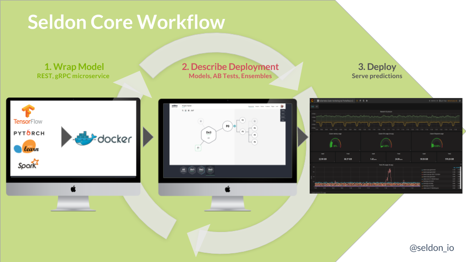

# 使用 Openshift Source-to-Image 促进机器学习部署

Seldon 旨在帮助组织将他们的数据科学项目投入生产，这样他们就可以减少获得投资回报的时间。通过帮助数据科学家将他们的数据科学模型投入生产、扩展它们、进行分析和修改它们，Seldon 允许数据科学家弥合从开发到生产的差距，并在机器学习中使用当前的 dev-ops 最佳实践。我们的核心产品运行在 Kubernetes 之上，可以在本地部署在云端。与企业就绪的 Kubernetes 发行版（如 Openshift）相集成，使我们能够提供坚实的基础，以提供我们的产品以用于要求苛刻的垂直行业，如金融科技行业。

[Seldon-Core](https://github.com/SeldonIO/seldon-core) 是一个开源项目，提供在 [Kubernetes](https://kubernetes.io/) 上运行的可扩展机器学习部署。的目标之一是允许数据科学家继续使用许多可用的机器学习工具包中的任何一种来构建他们的训练和推理组件，无论是基于 python（例如，TensorFlow、sklearn）、R 或 Java（例如，Spark、 H2O）在许多流行的选择中。Seldon-Core将允许他们轻松地在 Kubernetes 上打包和运行他们的运行时预测模块。为了实现这一目标，我们需要让数据科学家更容易获取他们的源代码，并将其以正确的形式打包为 Docker 格式的容器，以便 Seldon-Core 可以将其作为 Kubernetes 上运行时微服务图的一部分进行管理。 为此，我们利用 Openshift 的 Source-to-Image 开源库来允许以正确的格式打包任何代码，而对数据科学家的要求最低。

## Seldon-Core 概述

Seldon-core 提供在 Kubernetes 上运行的可扩展机器学习部署。要部署他们的模型数据科学家遵循如下所示的步骤：



1.  包装运行时模型为 Docker-formatted 镜像
1.  描述运行时图为 Kubernetes 资源
1.  使用 kubectl, Helm, ksonnet 等标准工具部署到 Kubernetes

一旦运行，它们的部署就可以随着为运行时模型创建新的映像版本以及对运行时图的更新而更新。

运行时图的组件可以是各种类型。最典型的是一个模型，它将在给定一些输入特征的情况下提供预测。通常，数据科学家将训练一个模型并保存模型参数以供运行时组件使用，该组件将在运行时提供新的预测。但是，Seldon-Core 允许创建一系列组件，这些组件可以作为构建块连接在一起，以创建更复杂的运行时图，如下所示：


您可以创建的组件类型可以包括：

- Models - 例如，TensorFlow、sklearn 模型
- Routers - 例如 AB 测试、多臂强盗
- Combiners - 例如，模型合奏器
- Transformers - 例如，特征归一化、异常值检测、概念漂移

如上图所示，这些需要作为 REST 或 gRPC 服务安装到 seldon-core 的微服务 API 中。

## Source-to-Image 集成

要将组件集成到 seldon-core 中，数据科学家需要完成两件事：

1.  源代码创建 Docker 格式的镜像
1.  遵循 seldon-core miroserice API 将您的组件包装为 REST 或 gRPC 微服务。


T为此，我们使用 Openshift 的 [source-to-image (s2i)](https://github.com/openshift/source-to-image) 开源工具。S2i 允许数据科学家使用可以轻松嵌入到持续集成管道中的单个命令行调用来包装他们的代码。 Seldon 提供了包含中间件代码的 s2i 构建映像来将科学家们的组件封装成一个遵循 seldon-core 微服务 API 的 REST 或 gRPC 服务。数据科学家所需要的只是在使用各种语言创建组件时遵循一些约定，如下所示。可在[此处](https://github.com/SeldonIO/seldon-core/tree/master/wrappers/s2i)查看更多 source-to-image 构建镜像。

### Python

python中有许多流行的机器学习库，包括Tensorflow、keras、sklearn、pyTorch和Statsmodels等等。要使用 Seldon-Core s2i 构建器映像来打包 python 模型，数据科学家只需提供：

- 具有运行模型的 python 类文件
- 可选 requirements.txt 或 setup.py
- .s2i/environment - s2i 构建器封装模型的模型定义

数据科学家的源代码应该包含一个 python 文件，该文件定义了一个与该文件同名的类。例如：

```python
class MyModel(object):
    """
    Model template. You can load your model parameters in __init__ from a location accessible at runtime
    """

    def __init__(self):
        """
        Add any initialization parameters. These will be passed at runtime from the graph definition parameters defined in your seldondeployment Kubernetes resource manifest.
        """
        print("Initializing")

    def predict(self,X,features_names):
        """
        Return a prediction.

        Parameters
        ----------
        X : array-like
        feature_names : array of feature names (optional)
        """
        print("Predict called - will run identity function")
        return X
```

- 该文件名为 MyModel.py，它定义了一个 MyModel 类
- 该类包含一个 predict 方法，该方法采用数组 (numpy) X 和 feature_names 并返回一个预测数组。
- 任何需要的初始化都可以放在类的 init 方法中。

可选的 requirements.txt 可以详细说明代码所需的任何软件依赖项。

为了让 s2i 构建器映像正确打包组件，数据科学家需要在源代码文件夹中的 .s2i/environment 文件中或在命令行中提供一些环境变量。一个例子是：

```bash
MODEL_NAME=MyModel
SERVICE_TYPE=MODEL
```

最后，我们使用 `s2i build` 从源代码创建 Docker 格式的镜像。使用 python3 代码示例如下：

```bash
s2i build <git-repo> seldonio/seldon-core-s2i-python3 <my-image-name>
s2i build <src-folder> seldonio/seldon-core-s2i-python3 <my-image-name>
```

## 概括

通过利用 Openshift 的 source-to-image 工具，数据科学家可以轻松构建 Docker 格式的镜像，以便使用 seldon-core 大规模部署其运行时组件。这允许数据科学团队使用最佳机器学习工具来完成任务，并以一致的方式部署生成的模型。seldon-core 项目致力于在不久的将来提供完整的 Openshift 集成，以便企业客户可以在其组织内轻松利用机器学习模型。

Seldon 将加入 Openshift Commons，并将出席 [Kubecon Europe 2018](https://events.linuxfoundation.org/events/kubecon-cloudnativecon-europe-2018/) 和 5 月 1 日星期二举行的 OpenShift Kubecon Europe 活动。请随时与我们联系，讨论 Seldon-Core 和 Openshift 以及它们如何协同工作以帮助数据科学家将机器学习投入生产。
