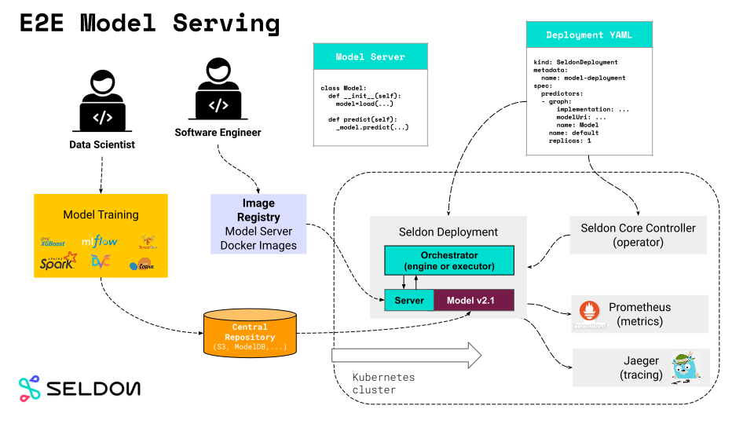
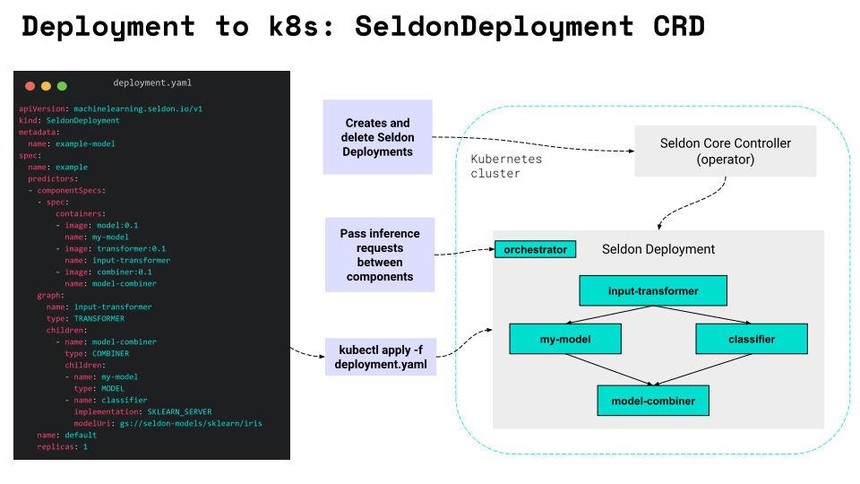
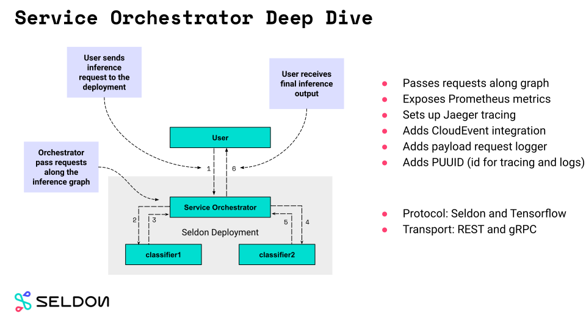

 # Seldon Core 组件概览

Seldon 将您的机器学习模型转换为 REST/gRPC 微服务。

以下为 seldon 主要组件：
- 可复用、不可复用 [模型服务](./overview.html#model-servers)
- [语言封装](./overview.html#language-wrappers) 容器化模型
- [SeldonDeployment](./overview.html#seldondeployment-crd) CRD 以及 [Seldon Core Operator](./overview.html#seldon-core-operator)
- 高级推理图 [服务治理](./overview.html#service-orchestrator) 

以及三方系统实现：
- 基于 [Ambassador](https://www.getambassador.io/) 和 [Istio](https://istio.io/) 实现的 Kubernetes Ingress 
- 基于 [Prometheus](https://prometheus.io/) 的 [指标](./overview.html#metrics-with-prometheus)
- 基于 [Jaeger](https://www.jaegertracing.io/) 的 [链路追踪](./overview.html#distributed-tracing-with-jaeger) 
- 基于 [OpenApi](https://swagger.io/docs/specification/about/) 的 [Endpoint 文档](./overview.html#endpoint-documentation)

保持阅读以学习更多内容


## E2E Serving 模型服务器

使用 `Seldon Core` 你可以非常灵活的将 `Model Servers` 直接用于生产环境。



使用所谓的 `Reusable Model Servers` 你可以在短短几步将模型部署到 Kubernetes 集群：

1. *数据科学家* 使用先进的类库如（mlflow, dvc, xgboost, scikit-learn 等）准备机器学习 `model` 。
2. 训练后的模型上传到中心化的存储库（比如S3存储）。
3. *软件工程师* 使用上传到镜像仓库的使用 `Seldon Core` 的 `Reusable Model Server`。
4. 使用发布单（`Seldon Deployment` CRD）创建并应用到 k8s 集群。
5. Seldon Core `Operator` 创建所有依赖的 Kubernetes 资源。
6. 发送到 `Seldon Deployment` 的所有推理请求会通过 `Service Orchestrator` 转发到内部模型。
7. 以通过利用我们与第三方框架的集成来收集指标和跟踪数据。

如果在步骤 2 和 3 中使用了`Non-Reusable Model Servers`，你需要准备一个 Docker 镜像来实现机器学习模型的嵌入，我们将在后续章节进行讨论两种方法的区别。

## 2 种类型的模型服务器

使用 Seldon Core，您可以构建两种类型的服务器：可复用和不可复用的服务器。
根据上下文和实际使用案例，每一个都很有用。

- **可复用模型服务**: 通常称为预封装模型服务器。
  允许部署每次无需重新打包新服务器的相似模型。
  他们经常从中心化仓库存储获取模型（比容公司的s3存储）。
- **不可复用模型服务**: 专用服务，旨在为单一特殊模型服务。
  不需要中央存储库，但需要为每个模型构建新镜像。


在相关文档页阅读更多关于预封装 `Model Servers`：
- [MLflow 服务](../servers/mlflow.html)
- [SKLearn 服务](../servers/sklearn.html)
- [Tensorflow 服务](../servers/tensorflow.html)
- [XGBoost 服务](../servers/xgboost.html)

从[这里](../servers/custom.html)阅读如何创建自己的预封装模型服务。

## 语言封装

语言封装允许 Seldon 用户创建构建 `Reusable` 和 `Non-Reusable` 模型服务。
如你所见，整个过程非常简单，
仅要求用户定义模型加载逻辑和推理预测的执行以来。


模型加载和推理逻辑在 `Model.py` 文件进行定义：
```python
class Model:
  def __init__(self, ...):
    """Custom logic that prepares model.

    - Reusable servers: your_loader 从远程仓库加载模型
    - Non-Reusable servers: your_loader loads model from a file embedded in the image.
    """
    self._model = your_loader(...)

  def predict(self, features, names=[], meta=[]):
    """Custom inference logic.""""
    return self._model.predict(...)
```

`Reusable` 和 `Non-Reusable` 模型服务的主要区别在于
模型是否动态加载或者内嵌于镜像。

`seldon-core-microservice` Python 封装器可将 `Model.py` 转成完全可操作的微服务：
```bash
$ seldon-core-microservice Model --service-type MODEL
```

这将在节点中启动服务（默认: 9000）:
```bash
$ curl http://localhost:9000/api/v1.0/predictions \
    -H 'Content-Type: application/json' \
    -d '{"data": {"names": ..., "ndarray": ...}}'

{
   "meta" : {...},
   "data" : {"names": ..., "ndarray" : ...}
}
```


要实现完全的容器化处理仍需两步：
- 描述运行时依赖的 `requirements.txt`
- 描述微服务的 `.s2/environment` (接口和模型类型）

一旦这些就位，您可以使用一个简单的 s2i 命令
```bash
s2i build . seldonio/seldon-core-s2i-python3:1.9.1 model:0.1
```
来准备创建 Docker 镜像。

请在专门的文档页阅读 Python [语言封装资料](../python/index.html)。


## Seldon Deployment CRD

Seldon Deployment CRD （自定义资源）是 Seldon Core 的真正优势所在。
它允许您轻松地将推理模型部署到 Kubernetes 集群并处理一些真正的生产流量！

[自定义资源](https://kubernetes.io/docs/concepts/extend-kubernetes/api-extension/custom-resources/)  是 Kubernetes API 的基础扩展。
它们允许你创建基本的 Kubernetes 对象的自定义组合并协同工作。
在 Seldon Core 我们通过 yaml 清单文件使用 CRDs 来定义推理图。

你编写的清单文件非常强大但简单。
您可以轻松地定义部署中所需的模型以及它们在推理图中的连接方式。



您可以将 CRD 视为围绕集群中创建的实际部署和服务的抽象。
一旦将清单应用于集群，Seldon Core `Operator` 将创建所有为推理请求服务所需的 Kubernetes 对象。

阅读更多 [Seldon Deployment CRD 资料文档](../reference/seldon-deployment.html).


## Seldon Core Operator

Seldon Core `Operator` 通过 [Kubebuilder](https://github.com/kubernetes-sigs/kubebuilder) 创建，
他将在 `Kubernetes` 集群控制 `Seldon Deployments`。
它会读取 `Seldon Deployment` CRD 资源定义并应用于集群，并自动创建所需 `Pods` 和 `Services` 组建。

它根据常见的 Kubernetes operator 模式运行 - 循环模式：
- `observe` 当前集群的状态
- `diff` 分配的状态
- 如果有必要，应用状态到 `act` 


## 服务编排

`Service Orchestrator` 负责管理图内流量。
当推理请求到达时，它从 `CRD` 中读取推理图结构，并保以正确的顺序将其传递到图的每个节点。

`Service Orchestrator` 因 `Seldon` 体系负责的图组件如：`routers`, `combiners` 以及输入输出 `transformers` 的可用性而存在。



`Service Orchestrator` 还负责提供许多开箱即用的高级特性：
- `Jaeger` 追踪
- `Prometheus` 指标
- 请求负载日志

仅举几例。

阅读更多 [Service Orchestrator 文档资料](../graph/svcorch.html).


## 元数据来源

在 `Seldon` 我们了解模型元数据的重要性。
您可以轻松地管理您的模型版本，并确定其输入和输出预期。

这些允许您通过 （DVC, Pachyderm 等）连接到您训练模型的平台，并确切的知道从推理图中得到预期的输入输出结果。


阅读更多有关[元数据来源的资料](../reference/apis/metadata.html).


## Prometheus指标

指标是生产中 ML 推理模型的重要一面。
Seldon Core 通过 `Service Orchestrator` 暴露标准的指标给 [Prometheus](https://prometheus.io/)。


阅读更多有关 [指标资料](../analytics/analytics.html).

## 使用 Jaeger 进行分布式跟踪

您可以使用 Open Tracing 来跟踪对 Seldon Core 的 API 调用。默认我们使用 [Jaeger](https://www.jaegertracing.io/) 进行分布式跟踪，这将允许您深入了解 Seldon 部署中每个微服务跃点的延迟和性能。


阅读更多有关[追踪资料文档](../graph/distributed-tracing.html).

## 所以，为什么不要 Flask 封装我的模型？

你可能会问：为什么我不简单地用 [Flask](https://flask.palletsprojects.com/) 封装我们的模型？

以下是选择 Seldon Core 的一些好处：
- 所有艰苦的工作都已经完成
- 开箱即用的复杂推理图
- 可重用的模型服务器（一次构建，多次部署）
- 与指标和跟踪解决方案的集成
- 自动配置入口
- Seldon Core 经过广泛的开源和商业用户社区的考验


## Seldon Core 的其他特性？

Seldon Core 的安装量超过 2M，跨组织用于管理机器学习模型的大规模部署，主要优势包括：

 * 使用我们的语言封装或预封装推理服务器将ML模型容器化部署简单化
 * 开箱即用，通过 Swagger UI, Seldon Python 客户端或 Curl / GRPCurl 进行测试
 * 云存储并通过 AWS EKS, Azure AKS, Google GKE, Alicloud, Digital Ocean 与 Openshift 测试
 * 由预测器、变压器、路由器、组合器等组成的强大而丰富的推理图。
 * 跨异构工具包和语言的模型的标准化服务层。
 * 与 Prometheus 和 Grafana 集成的高级和可自定义指标。
 * 通过模型输入-输出请求日志记录与 Elasticsearch 集成实现完全可审计性。
 * 通过与 Jaeger 集成进行微服务跟踪，以深入了解微服务节点之间的延迟。