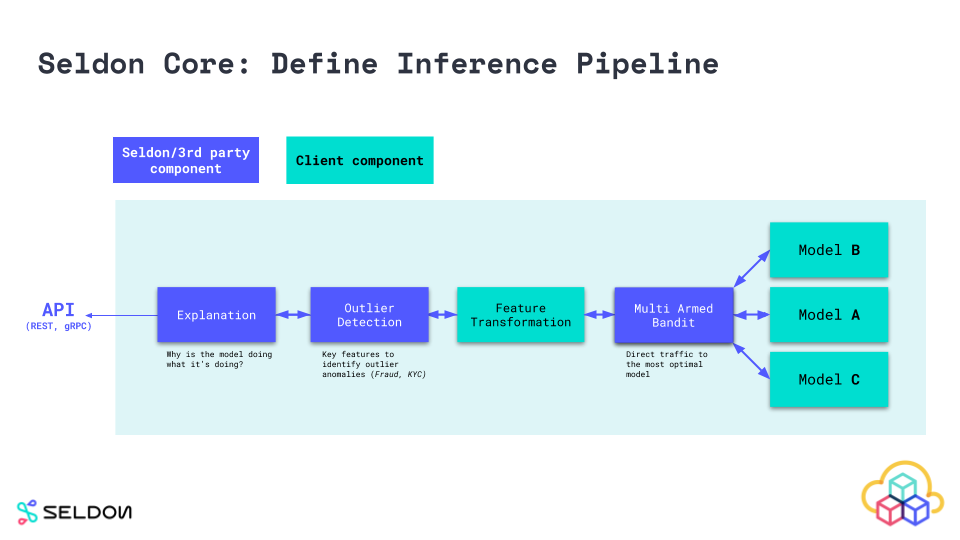

# 快速开始

在本页面中，我们汇总了一些容器化的示例，来帮助您启动并运行第一个 Seldon Core 模型。

我们将向您展示如何使用预先打包的模型服务器及用于更多自定义服务器的封装器来部署您的模型。

您可以深入了解 [Seldon Core 工作流](../workflow/index.html) 的每个组件和阶段。

## Seldon Core 工作流

一旦完成 [Seldon Core 安装](install.md)，你可以使用一下三个步骤来完成模型的生产化：

 1. 使用我们的预封装推理服务器或者语言封装器来封装模型
 1. 定义 Seldon Core 推理图
 1. 发布预估并监控性能

### 1. 封装模型

想要在生产中运行的组件需要封装为 [Seldon API 微服务](../reference/apis/internal-api.md)规范的 Docker 容器。 你可以创建提供预估服务的模型，定义请求去向的路由，A-B 测试，合并响应的组合器，以及可以传输请求或响应的转换器等一种组件。

为了让用户能够轻松地封装使用不同语言和工具包构建的机器学习组件，我们提供了封装器，使您可以轻松地构建在 seldon-core 内运行代码的 docker 容器。我们目前推荐的工具是 RedHat 的 Source-to-Image。更多细节可以在 [模型封装文档](../wrappers/language_wrappers.md)找到。

### 2. 定义运行时服务图

要在 Kubernetes 上运行机器学习图，您需要在最后一步中创建一个服务图来定义所创建的组件如何组合运行。这是在 `SeldonDeployment` Kubernetes 自定义资源中定义的。这里提供了 [推理图构建指南](../graph/inference-graph.md)。



### 3. 部署发布预估服务

像其他 Kubernetes 资源一样，你可以使用 `kubectl` 来部署 ML 服务。可在 [这里](deploying.md) 参与讨论。部署后，可通过 [调用公开 API ](serving.md) 来获取预估。


## Seldon Core 工作流示例


### 在集群安装 Seldon Core

**使用 Helm 3 安装（同样可以使用 Kustomize）**

```bash
kubectl create namespace seldon-system

helm install seldon-core seldon-core-operator \
    --repo https://storage.googleapis.com/seldon-charts \
    --set usageMetrics.enabled=true \
    --namespace seldon-system \
    --set istio.enabled=true
    # You can set ambassador instead with --set ambassador.enabled=true
```

有关展示如何使用不同参数和选项安装 Seldon Core 的高级指南，可在我们的 [详细安装指南](./install.html) 中进一步了解。

### 使用 Seldon Core 制作您的第一个模型

通过两种主要方式使用 Seldon Core 进行产品化：

* 使用我们预先封装的推理服务器封装您的模型
* 使用我们的语言封装器封装您的模型

#### 用我们预先封装的推理服务器封装您的模型

您可以使用我们针对主流机器学习框架和编程语言进行了优化的预封装推理服务器，并允许以简化的工作流扩展大量用例部署。

典型的工作流程通常是程序化的（通过 CI/CD 触发），但下面我们将展示您通常会执行的命令。

**1. 导出模型二进制文件/制品**

使用您计划使用的 [预封装模型服务器](../servers/overview.html) ，按照提供的概述说明导出模型二进制文件。

```python
>>my_sklearn_model.train(...)
>>joblib.dump(my_sklearn_model, "model.joblib")

[Created file at /mypath/model.joblib]
```

**2. 上传模型到对象存储**

您可以将模型上传到我们封装的模型文件下载服务支持的任何对象存储服务，或者添加自定义的文件下载器。

为简单起见，我们已经将其上传到存储桶，因此您可以继续下一步并在 Seldon Core 上运行您的模型。

```console
$ gsutil cp model.joblib gs://seldon-models/v1.10.0-dev/sklearn/iris/model.joblib

[ Saved into gs://seldon-models/v1.10.0-dev/sklearn/iris/model.joblib ]
```

**3. 部署到 Kubernetes 中的 Seldon Core**

最后，您可以通过使用选择的预封装模型服务器加载二进制文件/制品来部署您的模型。您可以构建使用多个组件进行推理的 [复杂推理图](../graph/inference-graph.html)。

```yaml
$ kubectl apply -f - << END
apiVersion: machinelearning.seldon.io/v1
kind: SeldonDeployment
metadata:
  name: iris-model
  namespace: model-namespace
spec:
  name: iris
  predictors:
  - graph:
      implementation: SKLEARN_SERVER
      modelUri: gs://seldon-models/v1.14.0/sklearn/iris
      name: classifier
    name: default
    replicas: 1
END
```

**4. 在 Kubernetes 集群中发送请求**

部署的每个模型都公开了一个标准化的用户界面，以使用 OpenAPI 模式发送请求。

可以直接通过访问 `http://<ingress_url>/seldon/<namespace>/<model-name>/api/v1.0/doc/` 在浏览器直接发送请求。


或者，您可以使用我们的 [Seldon Python 客户端](../python/seldon_client.html) 或其他 Linux CLI 工具发送请求：

```console
$ curl -X POST http://<ingress>/seldon/model-namespace/iris-model/api/v1.0/predictions \
    -H 'Content-Type: application/json' \
    -d '{ "data": { "ndarray": [1,2,3,4] } }' | json_pp

{
   "meta" : {},
   "data" : {
      "names" : [
         "t:0",
         "t:1",
         "t:2"
      ],
      "ndarray" : [
         [
            0.000698519453116284,
            0.00366803903943576,
            0.995633441507448
         ]
      ]
   }
}
```

#### 使用我们的语言封装器封装您的模型

以下是使用 Seldon Core 语言封装器容器化模型的高级步骤。

语言封装器用于更多我们的预封装模型服务器未涵盖依赖的自定义用例。可以使用我们已孵化的 Python 和 Java 构建语言封装器 - 有关更多详细信息，请查看我们的 [语言封装器部分](../wrappers/language_wrappers.html)。

**1. 导出模型二进制文件/制品：**

在这种情况下，我们还将导出模型二进制文件/制品，除此之外还需处理加载模型的逻辑。这意味着我们可以使用第三方依赖甚至外部系统调用。Seldon Core 可运行异构模型的生产用例。

```python
>> my_sklearn_model.train(...)
>> joblib.dump(my_sklearn_model, "model.joblib")

[Created file at /mypath/model.joblib]
```

**2. 创建封装类 Model.py**

以下示例，我们使用 Python 语言封装器，它允许我们创建一个自定义封装器文件通过 `predict` 方法公开所有功能 - 通过 API 发送 HTTP/GRPC 请求都传递给该函数，并且输出该函数返回的任何内容响应。

Python SDK 还支持其他功能，例如 `load` 加载逻辑、自定义 Prometheus 指标 `metrics`、元数据 `tags` 等。

```python
class Model:
    def __init__(self):
        self._model = joblib.load("model.joblib")

    def predict(self, X):
        output = self._model(X)
        return output
```

**3. 本地测试模型**

在我们将模型部署到生产环境之前，我们实际上可以使用 [Python seldon-core Module](../python/python_module.md) 微服务 CLI 功能在本地运行我们的模型。

```console
$ seldon-core-microservice Model REST --service-type MODEL

2020-03-23 16:59:17,366 - werkzeug:_log:122 - INFO:   * Running on http://0.0.0.0:5000/ (Press CTRL+C to quit)

$ curl -X POST localhost:5000/api/v1.0/predictions \
    -H 'Content-Type: application/json' \
    -d '{ "data": { "ndarray": [1,2,3,4] } }' \
    | json_pp

{
   "meta" : {},
   "data" : {
      "names" : [
         "t:0",
         "t:1",
         "t:2"
      ],
      "ndarray" : [
         [
            0.000698519453116284,
            0.00366803903943576,
            0.995633441507448
         ]
      ]
   }
}
```

**4. 使用 Seldon 工具来将模型容器化**

现在我们可以使用 Seldon Core 实用程序将我们的 Python 类转换为一个完全成熟的 Seldon Core 微服务。示例中，我们还将容器化模型二进制文件。

以下结果生成一个名为 `sklearn_iris` 标签为 `0.1` 的可使用 Seldon Core 部署的容器镜像。

```console
s2i build . seldonio/seldon-core-s2i-python3:1.10.0-dev sklearn_iris:0.1
```

**5. 发布到 Kubernetes**

与预先封装的模型服务器类似，在这里我们定义了部署结构，但是我们还须指定我们刚刚构建的镜像，以及我们可能想要进一步添加的任何 containerSpec 选项。

```yaml
$ kubectl apply -f - << END
apiVersion: machinelearning.seldon.io/v1
kind: SeldonDeployment
metadata:
  name: iris-model
  namespace: model-namespace
spec:
  name: iris
  predictors:
  - componentSpecs:
    - spec:
      containers:
      - name: classifier
        image: sklearn_iris:0.1
  - graph:
      name: classifier
    name: default
    replicas: 1
END
```

**6. 向在 Kubernetes 中部署的模型发送请求**

每个部署的模型都公开能够使用 OenAPI 发送请求的用户界面。

可通过访问 `http://<ingress_url>/seldon/<namespace>/<model-name>/api/v1.0/doc/` 直接在浏览器发送请求。


或者，您使用我们的 [Seldon Python 客户端](../python/seldon_client.html)或其他 Linux CLI 发送请求：

```console
$ curl -X POST http://<ingress>/seldon/model-namespace/iris-model/api/v1.0/predictions \
    -H 'Content-Type: application/json' \
    -d '{ "data": { "ndarray": [1,2,3,4] } }' | json_pp

{
   "meta" : {},
   "data" : {
      "names" : [
         "t:0",
         "t:1",
         "t:2"
      ],
      "ndarray" : [
         [
            0.000698519453116284,
            0.00366803903943576,
            0.995633441507448
         ]
      ]
   }
}
```

## 动手实例

下面是一组 Jupyter 笔记，您可以自己试用它们来部署 Seldon Core 以及使用一些更高级的功能。

### 预打包服务器

 * [发布 Scikit-learn 二进制模型](../servers/sklearn.html)
 * [发布 Tensorflow 导出模型](../servers/tensorflow.html)
 * [MLflow 预封装模型服务 A/B Test](../examples/mlflow_server_ab_test_ambassador.html)
 * [发布 XGBoost 二进制模型](../servers/xgboost.html)
 * [使用集群 MinIO 发布预封装模型服务](../examples/minio-sklearn.html)

### 自定义推理代码的推荐入门教程

* [Tensorflow Deep MNIST 教程](../examples/tfserving_mnist.html) （尝试在 [AWS](../examples/aws_eks_deep_mnist.html)，[Azure](../examples/azure_aks_deep_mnist.html)，[带有GPU 的 GKE](../examples/gpu_tensorflow_deep_mnist.html) 以及 [阿里云](../examples/alibaba_ack_deep_mnist.html)中使用）
* [SKlearn SpaCy Reddit Text Classification 教程](../examples/sklearn_spacy_text_classifier_example.html)
* [发布 Java H2O 模型示例](../examples/h2o_mojo.html)

### 更复杂的部署

* [使用 Helm 部署 Seldon Core Deployments 示例](../examples/helm_examples.html)
* [使用 Seldon 和 Istio 进行 Canary 部署](../examples/istio_canary.html)
* [自动缩放 Seldon 示例](../examples/autoscaling_example.html)
* [自定义 Seldon 模型指标](../examples/custom_metrics.html)

### 手把手使用教程

* [使用 Seldon 和 Kubeflow 的手把手可服用 ML 管道](../examples/kubeflow_seldon_e2e_pipeline.html)
* [Seldon 部署 Income Classifier 和 Alibi Anchor Explainer](../examples/explainer_examples.html)

### 与其他平台的集成

* [Sagemaker (Seldon SKLearn 集成示例)](../examples/sagemaker_sklearn.html)
* [Tensorflow Serving (TFServing) 集成示例](../examples/tfserving_mnist.html)
* [MLFlow 集成示例](../examples/mlflow_server_ab_test_ambassador.html)

## 关于 「Seldon Core」 这个名字

Seldon (ˈSɛldən) Core 这个名字的灵感来自于 [the Foundation Series (Scifi Novel)](https://en.wikipedia.org/wiki/Foundation_series) 它的是由一位名叫 「Hari Seldon」 的数学家组成，他毕生都在发展一种心理历史理论，这是一种新的有效的数学社会学，可以展望未来在很长一段时间内（跨越数十万年）进行极其准确的预测。
