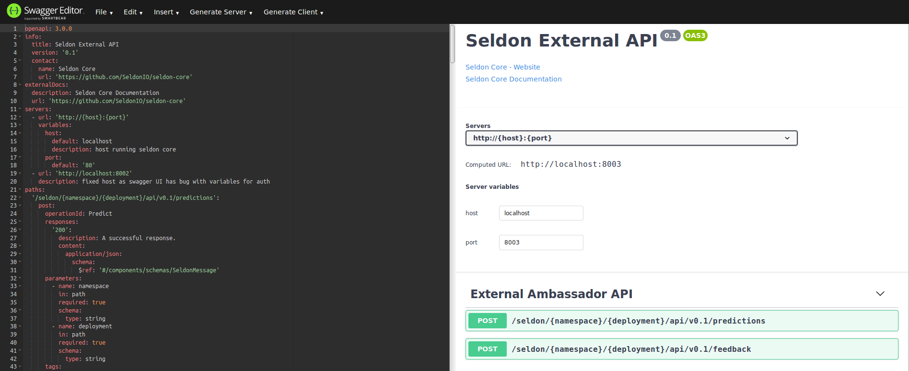

# Seldon Core API 的 V3 版本开放 API

我们为你的 APIs 提供初始的 [OpenAPI](https://www.openapis.org/) 3.0 定义。

 * [Seldon Core 通过 Ambassador 对外](https://github.com/SeldonIO/seldon-core/blob/master/openapi/engine.oas3.json) 
 * [Seldon Core 内部微服务 API](https://github.com/SeldonIO/seldon-core/blob/master/openapi/wrapper.oas3.json) 

你可以在运行时从你的 API 终端路径 `/seldon.json` 找到 API 定义。

这需要运行 0.2.4-SNAPSHOT 或更新的版本来使终端生效。

## 通过 Swagger-UI 查看/测试

你可以使用 [Swagger UI 工具](https://swagger.io/tools/swagger-ui/) 查看 API。

可通过 Docker 运行：

```bash
docker run --network host --rm  swaggerapi/swagger-editor
```

通过 http://localhost:8080/ 访问。

打开上面提及的两个 API 定义。



使用 Swagger "try it out" 特性时这里有些 Swagger UI bug 警告：

 * 针对 [Seldon Core 通过 Ambassador 对外](https://github.com/SeldonIO/seldon-core/blob/master/openapi/engine.oas3.json)
     * 您将需要使用硬连线主机，localhost:8002 用于授权，因为目前 Swagger UI 无法处理授权调用中的变量。
     * Y您需要使用浏览器网络控制台从返回的json中获取承载令牌，因为 Swagger UI 不会显示这一点。
 * 针对 [Seldon 内部 API](https://github.com/SeldonIO/seldon-core/blob/master/openapi/wrapper.oas3.json)
     * 在 GET 调用中你无法修改透传的 JSON 字符串。


## 贡献和路线图

我们欢迎对改进这些初始 API 规范作出贡献。

我们计划研究如何定制这些 API，以显示在 Seldon Core 下运行的特定机器学习推理图的可接受有效载荷。欢迎提出建议。


